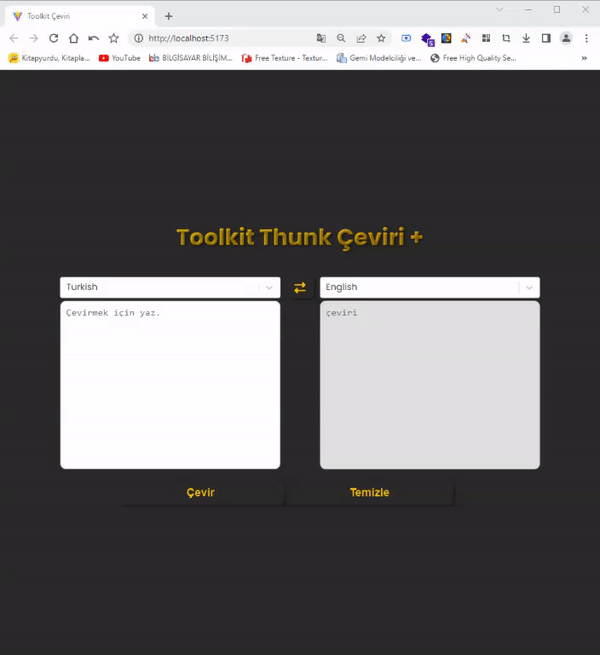

<h1>Toolkit Thunk Çeviri +</h1>
React ve Redux kullanılarak geliştirilmiş bir çeviri uygulamasıdır. Bu uygulama sayesinde kullanıcılar metinleri seçtikleri kaynak dilinden hedef dile çevirebilirler. Aşağıda, projeyle ilgili detaylı bilgileri ve uygulamanın nasıl kullanılacağına dair talimatları bulabilirsiniz.

<h3>Amaç</h3>
Toolkit Thunk Çeviri +, kullanıcıların metinleri kolaylıkla çevirebilmelerini sağlamak amacıyla geliştirilmiştir. Uygulama, bir metin çeviri hizmeti olan RapidAPI'yi kullanarak çevirileri gerçekleştirir. Kullanıcılar, kaynak dil ve hedef dil seçimleriyle metinlerini çevirebilir ve çeviri sonuçlarını görüntüleyebilirler. 

<h3>Özellikler</h3>
<ul>
    <li>Metin çevirisi yapabilme</li>
<li>Kaynak dil ve hedef dil seçebilme</li>
<li>Otomatik dil algılama</li>
<li>Çeviri sonuçlarını görüntüleme</li>
<li>Hata yönetimi (boş metin, hatalı çeviri isteği gibi durumlar)</li>
<li>Kullanıcı dostu arayüz</li>

</ul> 

<h3>Kullanılan Teknolojiler</h3>
<ul>
    <li>React</li>
    <li>Redux (Toolkit)</li>
    <li>react-redux</li>
    <li>react-select</li>
    <li>axios</li>
    <li>react-toastify</li>
</ul> 

<h3>Kurulum</h3>
Bu depoyu yerel bir dizine klonlayın. 
Klonlanan dizine gidin: cd toolkit-thunk-ceviri 
Gerekli bağımlılıkları yüklemek için aşağıdaki komutu çalıştırın: npm install 
Uygulamayı başlatmak için aşağıdaki komutu çalıştırın: npm start  

<h3>Kullanım</h3>
Tarayıcınızda uygulamayı açın. 
Sol tarafta bulunan dil seçim kutusundan kaynak dilinizi seçin. 
"Çevirmek için yaz" yazan metin giriş kutusuna çevirmek istediğiniz metni yazın. 
Sağ tarafta bulunan dil seçim kutusundan hedef dilinizi seçin. 
"Çevir" düğmesine tıklayın. 
Çeviri sonucu sağ tarafta görüntülenecektir. 
Metinleri temizlemek için "Temizle" düğmesine tıklayabilirsiniz. Bu, kaynak metin ve çeviri sonuçlarını temizleyecektir. 
Kaynak dil ve hedef dil arasında hızlı bir değişiklik yapmak için "Dil Değiştir" düğmesine tıklayabilirsiniz. Bu, seçilen dilleri birbiriyle değiştirecek ve metin giriş kutularını temizleyecektir. 
Hata durumlarında, uygulama hata mesajlarını kullanıcıya bildirecektir. Örneğin, metin girişi boşsa veya çeviri isteği başarısız olursa hata mesajları gösterilecektir .
Uygulama, toast bildirimleri aracılığıyla bilgilendirme ve hata mesajlarını kullanıcıya gösterecektir. Toast bildirimleri alt kısımda görüntülenecektir. 
İşlemler tamamlandıktan sonra, uygulamayı kullanmaya devam edebilir ve çevirilerin keyfini çıkarabilirsiniz. 

<h3>Önemli Notlar</h3>
Çeviri hizmeti RapidAPI üzerinden sağlanmaktadır. Kendi RapidAPI kimlik bilgilerinizi kullanarak bu uygulamayı çalıştırmanız gerekebilir.
Bu uygulama örnek amaçlıdır. Gerçek bir ürün olarak kullanılması için geliştirmeler ve güncellemeler gerekebilir. 
Bu README dosyası, Toolkit Thunk Çeviri + uygulamasını tanıtmak ve kullanıcıların projeyi başlatmalarına yardımcı olmak amacıyla oluşturulmuştur. Uygulama ve kullanımı hakkında daha fazla ayrıntı için geliştirme ekibiyle iletişime geçebilirsiniz. 

İyi kullanımlar!

<h3><a href="">Canlı Önizleme</a></h3>

